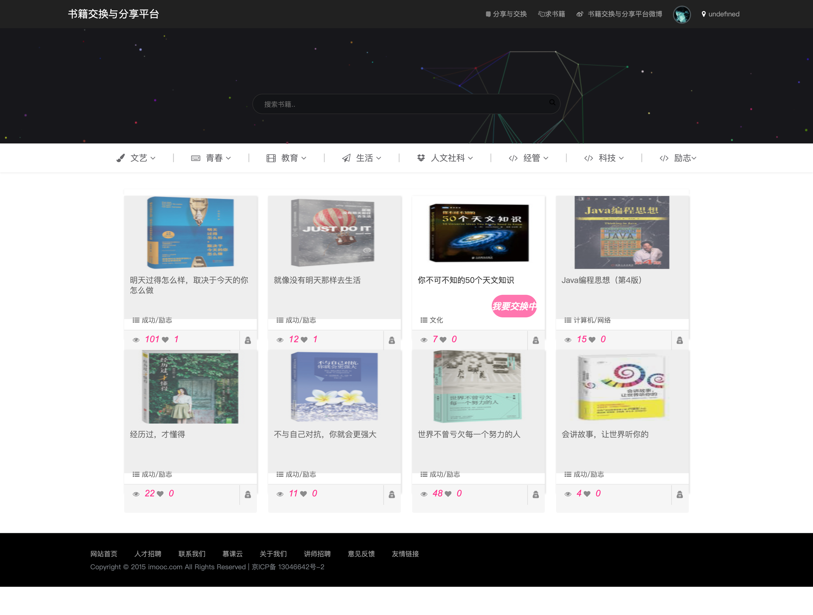
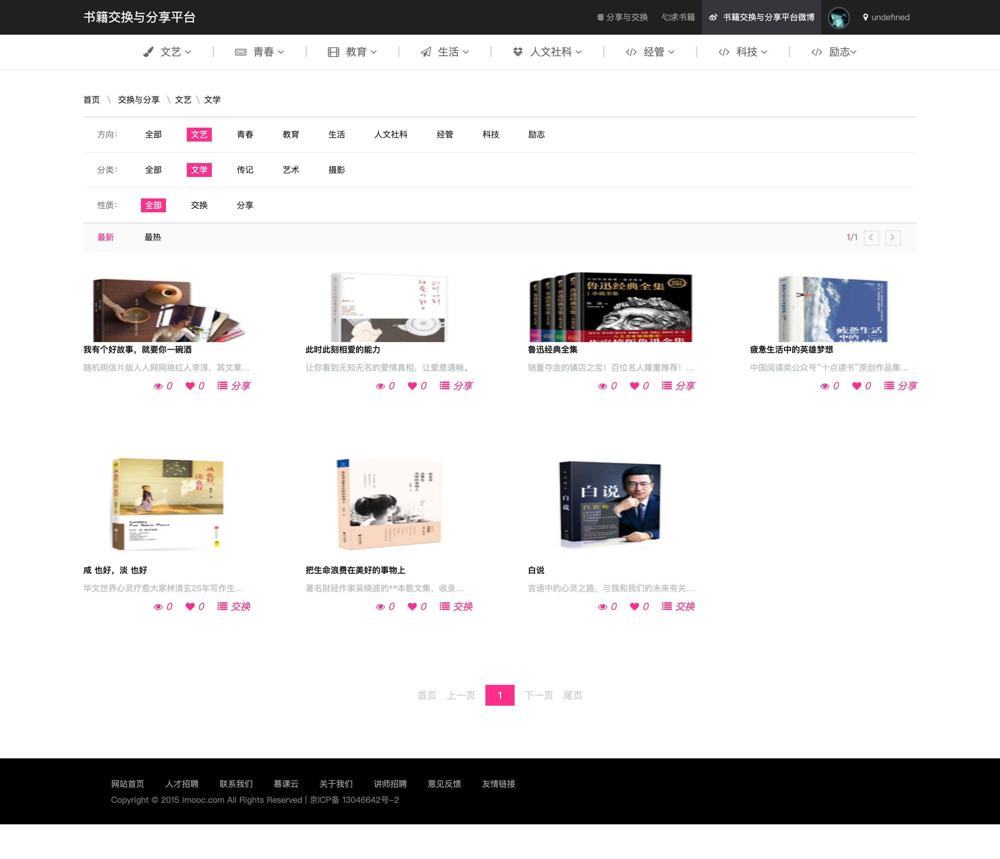
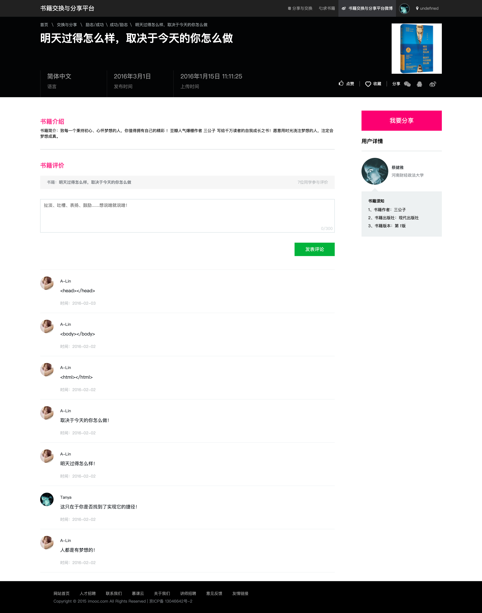
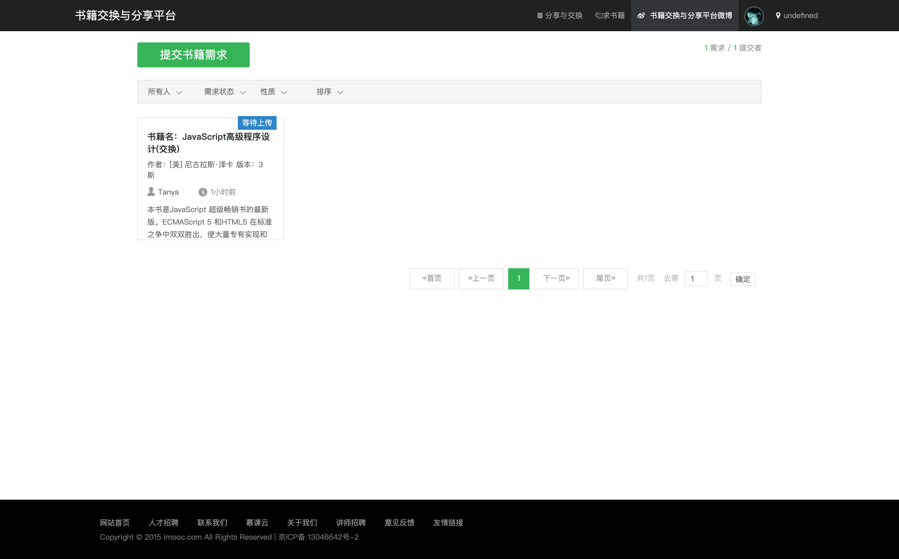
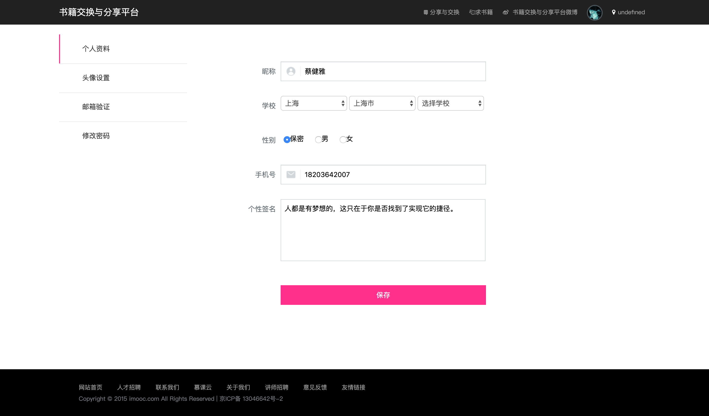
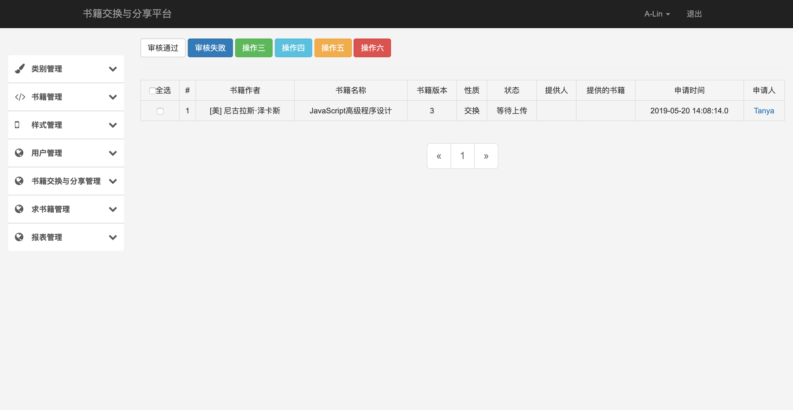

## 书籍交换与分享平台

> 2015.09 - 2016.05 毕业设计项目

### 环境配置

- jdk 1.8.0_212
- tomcat 7.0.94
- maven 3.6.1
- mysql 5.7.25

### 数据库 Mysql 配置

> 配置所在路径：`beasp-core/src/main/resources/db.properties`

#### 账户/密码

- 默认用户：root
- 默认密码：

### 项目内容

#### 网站端

#### 管理端

